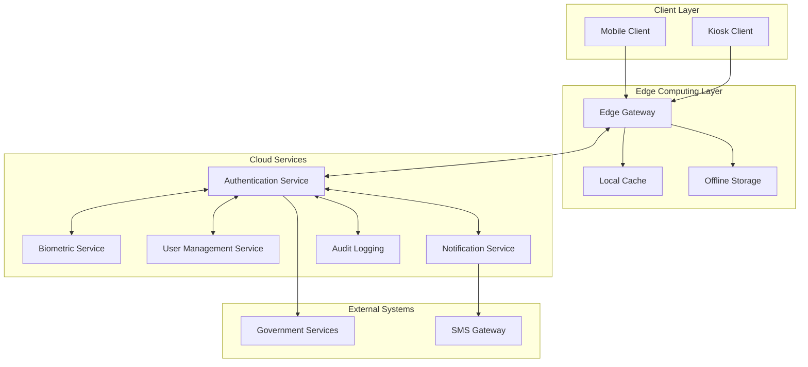
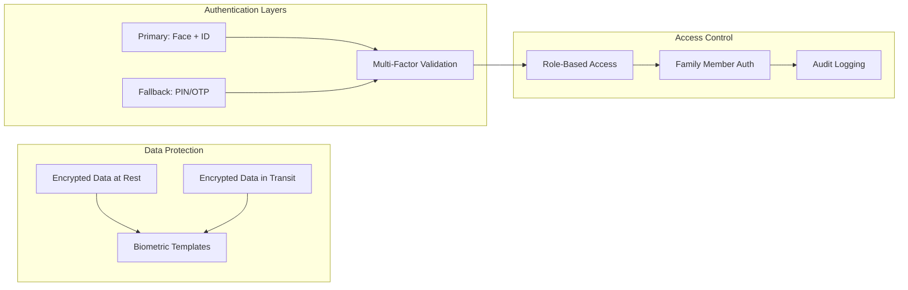

# Design Document: Rural Identity Verification System

## Overview

The Rural Identity Verification System is a secure, multi-platform authentication solution designed for government benefit access in areas with limited infrastructure. The system employs a hybrid architecture combining edge computing capabilities with cloud synchronization, enabling reliable operation in both connected and offline scenarios.

The core design philosophy prioritizes security, accessibility, and resilience. By leveraging AI-based facial recognition as the primary authentication method with robust fallback mechanisms, the system ensures authorized users can access benefits regardless of technical constraints or environmental conditions.

## Architecture

### High-Level Architecture



### Edge Computing Architecture

The system employs edge computing to ensure functionality in rural environments with limited connectivity. Each deployment location (kiosk or mobile device cluster) includes:

- **Local Authentication Engine**: Processes biometric verification using cached templates
- **Offline Transaction Queue**: Stores verification attempts for later synchronization
- **Security Module**: Handles encryption/decryption of sensitive data locally
- **Sync Manager**: Manages data synchronization when connectivity is available

### Security Architecture



## Components and Interfaces

### 1. Biometric Authentication Engine

**Purpose**: Handles facial recognition and ID document validation

**Key Components**:
- Face Detection Module: Identifies and extracts facial features from camera input
- Template Matching Engine: Compares extracted features against stored biometric templates
- ID Document Scanner: Processes government-issued identification documents
- Liveness Detection: Prevents spoofing attacks using presentation attack detection

**Interfaces**:
- `authenticateUser(faceImage, idDocument) -> AuthenticationResult`
- `enrollUser(faceImage, idDocument, userInfo) -> EnrollmentResult`
- `validateLiveness(faceImage) -> LivenessResult`

**Technology Stack**: Based on research, the system will use FIDO2-compliant biometric standards with local processing capabilities to meet government security requirements while enabling offline operation.

### 2. Fallback Authentication Service

**Purpose**: Provides alternative authentication when primary methods fail

**Key Components**:
- PIN Validation Module: Securely validates user-provided PINs
- OTP Generation Service: Creates and validates one-time passwords
- SMS Integration: Delivers OTP codes to registered mobile numbers
- Fallback Decision Engine: Determines when to trigger fallback methods

**Interfaces**:
- `validatePIN(userId, pin) -> ValidationResult`
- `generateOTP(userId) -> OTPResult`
- `validateOTP(userId, otp) -> ValidationResult`
- `triggerFallback(authenticationFailure) -> FallbackOptions`

### 3. Multi-Platform Client Framework

**Purpose**: Provides consistent user experience across mobile and kiosk platforms

**Mobile Client Components**:
- Camera Interface: Captures facial images and ID documents
- Offline Storage Manager: Caches authentication data locally
- Network Sync Service: Synchronizes with cloud services when available
- Accessibility Features: Voice guidance and visual aids

**Kiosk Client Components**:
- Touch Interface Controller: Manages kiosk-specific interactions
- Hardware Integration Layer: Interfaces with kiosk cameras and sensors
- Session Management: Handles user sessions and timeouts
- Maintenance Mode: Provides diagnostic and update capabilities

**Shared Interfaces**:
- `startAuthenticationSession() -> SessionId`
- `captureUserInput(inputType) -> InputData`
- `displayGuidance(step, language) -> void`
- `completeAuthentication(result) -> void`

### 4. Edge Computing Gateway

**Purpose**: Enables offline operation and local data processing

**Key Components**:
- Local Authentication Cache: Stores encrypted biometric templates
- Transaction Queue Manager: Handles offline authentication attempts
- Data Synchronization Engine: Manages cloud sync when connectivity returns
- Security Enforcement Module: Applies encryption and access controls

**Interfaces**:
- `processOfflineAuthentication(authRequest) -> AuthResult`
- `queueTransaction(transaction) -> QueueResult`
- `synchronizeWithCloud() -> SyncResult`
- `validateSecurityPolicy(request) -> PolicyResult`

### 5. Family Authorization Manager

**Purpose**: Manages authorized family member access to benefits

**Key Components**:
- Relationship Validator: Verifies family member authorization
- Consent Management: Tracks and validates user consent for delegation
- Proxy Authentication: Handles authentication on behalf of primary users
- Audit Trail Generator: Logs all family member access attempts

**Interfaces**:
- `authorizeFamily Member(primaryUserId, familyMemberId) -> AuthorizationResult`
- `validateConsent(primaryUserId, consentType) -> ConsentResult`
- `authenticateProxy(familyMemberId, primaryUserId) -> ProxyAuthResult`
- `logFamilyAccess(accessDetails) -> AuditResult`

## Data Models

### User Profile
```
User {
  userId: UUID
  personalInfo: {
    firstName: string
    lastName: string
    dateOfBirth: date
    governmentId: string
  }
  biometricTemplate: EncryptedBiometricData
  contactInfo: {
    phoneNumber: string (encrypted)
    alternateContact: string (encrypted)
  }
  authenticationMethods: {
    faceRecognition: boolean
    pinEnabled: boolean
    otpEnabled: boolean
  }
  familyMembers: FamilyMember[]
  createdAt: timestamp
  lastAuthenticated: timestamp
  status: enum [ACTIVE, SUSPENDED, INACTIVE]
}
```

### Authentication Session
```
AuthenticationSession {
  sessionId: UUID
  userId: UUID
  deviceId: string
  location: GeoLocation
  authenticationMethod: enum [FACE_ID, PIN, OTP, FAMILY_PROXY]
  attempts: AuthenticationAttempt[]
  status: enum [PENDING, SUCCESS, FAILED, EXPIRED]
  createdAt: timestamp
  expiresAt: timestamp
  completedAt: timestamp
}
```

### Family Member Authorization
```
FamilyMember {
  familyMemberId: UUID
  primaryUserId: UUID
  relationship: enum [SPOUSE, CHILD, PARENT, GUARDIAN, OTHER]
  authorizationLevel: enum [FULL_ACCESS, LIMITED_ACCESS]
  consentGiven: boolean
  consentDate: timestamp
  isActive: boolean
  createdAt: timestamp
}
```

### Offline Transaction
```
OfflineTransaction {
  transactionId: UUID
  sessionId: UUID
  userId: UUID
  deviceId: string
  authenticationData: EncryptedAuthData
  timestamp: timestamp
  syncStatus: enum [PENDING, SYNCED, FAILED]
  retryCount: number
  lastSyncAttempt: timestamp
}
```

Now I need to use the prework tool to analyze the acceptance criteria before writing the Correctness Properties section:

<function_calls>
<invoke name="prework">
<parameter name="featureName">rural-identity-verification

## Correctness Properties

*A property is a characteristic or behavior that should hold true across all valid executions of a system—essentially, a formal statement about what the system should do. Properties serve as the bridge between human-readable specifications and machine-verifiable correctness guarantees.*

The following properties define the correctness requirements for the Rural Identity Verification System. Each property represents a universal rule that must hold across all valid system executions and will be validated through property-based testing.

### Property 1: Biometric Authentication Accuracy
*For any* registered user with valid biometric data, when presenting their face and ID document under normal conditions, the system should successfully authenticate them with at least 95% accuracy across multiple attempts.
**Validates: Requirements 1.1, 1.4**

### Property 2: Authentication Performance
*For any* valid authentication request under normal system conditions, the system should complete the authentication process and grant access within 10 seconds.
**Validates: Requirements 1.2, 6.3**

### Property 3: ID Document Data Extraction
*For any* valid government-issued ID document, the system should successfully extract and validate all required information fields (name, ID number, expiration date).
**Validates: Requirements 1.3**

### Property 4: Comprehensive Data Encryption
*For any* biometric data processed by the system, it should be encrypted using AES-256 when stored at rest, and all data transmission should use TLS 1.3 or higher encryption.
**Validates: Requirements 1.5, 5.1, 5.2**

### Property 5: Fallback Authentication Trigger
*For any* authentication session where facial recognition fails 3 consecutive times, the system should automatically offer fallback authentication options (PIN or OTP).
**Validates: Requirements 2.1**

### Property 6: PIN Authentication Validation
*For any* user with PIN authentication enabled, when a correct 6-digit PIN is provided, the system should successfully validate it against stored credentials.
**Validates: Requirements 2.2**

### Property 7: OTP Generation and Delivery
*For any* user requesting OTP authentication, the system should generate a unique one-time password and deliver it to their registered mobile number within 30 seconds.
**Validates: Requirements 2.3, 2.4**

### Property 8: Authentication Method Equivalence
*For any* successful authentication (whether primary facial recognition or fallback methods), the system should grant identical access levels and permissions to benefit services.
**Validates: Requirements 2.5, 4.4**

### Property 9: Offline Data Caching
*For any* essential verification data, when network connectivity becomes limited, the system should successfully cache the data locally to enable offline authentication operations.
**Validates: Requirements 3.3**

### Property 10: Offline Transaction Synchronization
*For any* authentication transactions completed while offline, when network connectivity is restored, the system should successfully synchronize all transaction logs with the cloud services.
**Validates: Requirements 3.4**

### Property 11: Family Member Authorization
*For any* pre-registered family member with valid authorization, the system should allow them to access benefits on behalf of the primary recipient after successful authentication.
**Validates: Requirements 4.1**

### Property 12: Family Member Access Indication
*For any* successful family member authentication, the system should clearly display an indication that they are acting on behalf of another person throughout the session.
**Validates: Requirements 4.2**

### Property 13: Comprehensive Audit Logging
*For any* access attempt (whether by primary users or family members), the system should create audit logs containing timestamps, user identifiers, authentication methods, and access details.
**Validates: Requirements 4.3, 5.4**

### Property 14: Family Member Consent Requirement
*For any* family member registration attempt, the system should require and validate explicit consent from the primary recipient before completing the registration.
**Validates: Requirements 4.5**

### Property 15: Secure Data Deletion
*For any* biometric data that reaches its retention policy limit, the system should securely delete the data using cryptographically secure deletion methods.
**Validates: Requirements 5.3**

### Property 16: Suspicious Activity Response
*For any* detected suspicious activity pattern, the system should temporarily lock the affected account and send notifications to system administrators.
**Validates: Requirements 5.5**

### Property 17: Intermittent Connectivity Handling
*For any* verification requests made during intermittent network connectivity, the system should queue the requests and process them automatically when stable connection is restored.
**Validates: Requirements 6.2**

### Property 18: High Load Performance
*For any* authentication request made during high system load conditions, the system should maintain response times under 30 seconds.
**Validates: Requirements 6.4**

### Property 19: Error Message Clarity
*For any* technical issue or error condition, the system should provide clear error messages with specific recovery instructions appropriate to the user's context.
**Validates: Requirements 6.5**

### Property 20: Accessibility Feature Availability
*For any* verification step in the authentication process, the system should provide both audio instructions and visual guidance to support users with different accessibility needs.
**Validates: Requirements 7.1, 7.4**

### Property 21: Multi-Language Support
*For any* supported local language setting, the system should provide complete functionality and user interface elements in that language.
**Validates: Requirements 7.2**

### Property 22: Help System Responsiveness
*For any* user help request, the system should provide clear, step-by-step instructions with appropriate visual aids relevant to the user's current context.
**Validates: Requirements 7.3**

### Property 23: Interaction Efficiency
*For any* complete verification process, the system should require no more than 5 user interactions to complete authentication and access benefits.
**Validates: Requirements 7.5**

## Error Handling

The system implements comprehensive error handling across all components to ensure graceful degradation and clear user guidance:

### Authentication Errors
- **Biometric Matching Failures**: Provide clear feedback and automatically offer fallback options after 3 attempts
- **ID Document Processing Errors**: Guide users to reposition documents with visual indicators
- **Liveness Detection Failures**: Provide instructions for proper positioning and lighting

### Network and Connectivity Errors
- **Offline Mode Activation**: Seamlessly transition to cached authentication when connectivity is lost
- **Sync Failures**: Implement exponential backoff retry logic with user notification
- **Partial Connectivity**: Prioritize critical authentication data in limited bandwidth scenarios

### Hardware and Platform Errors
- **Camera Access Issues**: Provide alternative input methods and clear troubleshooting steps
- **Storage Limitations**: Implement intelligent cache management with user notification
- **Performance Degradation**: Gracefully reduce non-essential features while maintaining core functionality

### Security and Privacy Errors
- **Encryption Failures**: Fail securely by blocking operations until encryption is restored
- **Suspicious Activity Detection**: Implement graduated response from warnings to account lockout
- **Data Retention Violations**: Automatically enforce deletion policies with audit trails

## Testing Strategy

The system employs a dual testing approach combining unit tests for specific scenarios with property-based tests for comprehensive validation:

### Property-Based Testing
- **Framework**: QuickCheck-style property testing library appropriate for the chosen implementation language
- **Test Configuration**: Minimum 100 iterations per property test to ensure statistical confidence
- **Coverage**: Each correctness property implemented as a separate property-based test
- **Tagging**: Each test tagged with format: **Feature: rural-identity-verification, Property {number}: {property_text}**

### Unit Testing
- **Specific Examples**: Test concrete scenarios that demonstrate correct behavior
- **Edge Cases**: Validate boundary conditions and error states
- **Integration Points**: Verify component interactions and data flow
- **Platform Compatibility**: Ensure consistent behavior across mobile and kiosk platforms

### Test Data Management
- **Synthetic Biometric Data**: Generate realistic but non-personal biometric templates for testing
- **Mock Government IDs**: Create valid test documents that follow real formatting without using actual personal information
- **Network Simulation**: Test offline/online transitions and various connectivity scenarios
- **Load Testing**: Validate performance requirements under various system load conditions

### Compliance Testing
- **Security Standards**: Verify encryption, secure deletion, and access control implementations
- **Accessibility Standards**: Validate compliance with accessibility guidelines for rural and impaired users
- **Privacy Regulations**: Ensure biometric data handling meets applicable regulatory requirements
- **Performance Benchmarks**: Validate response times and accuracy requirements under various conditions